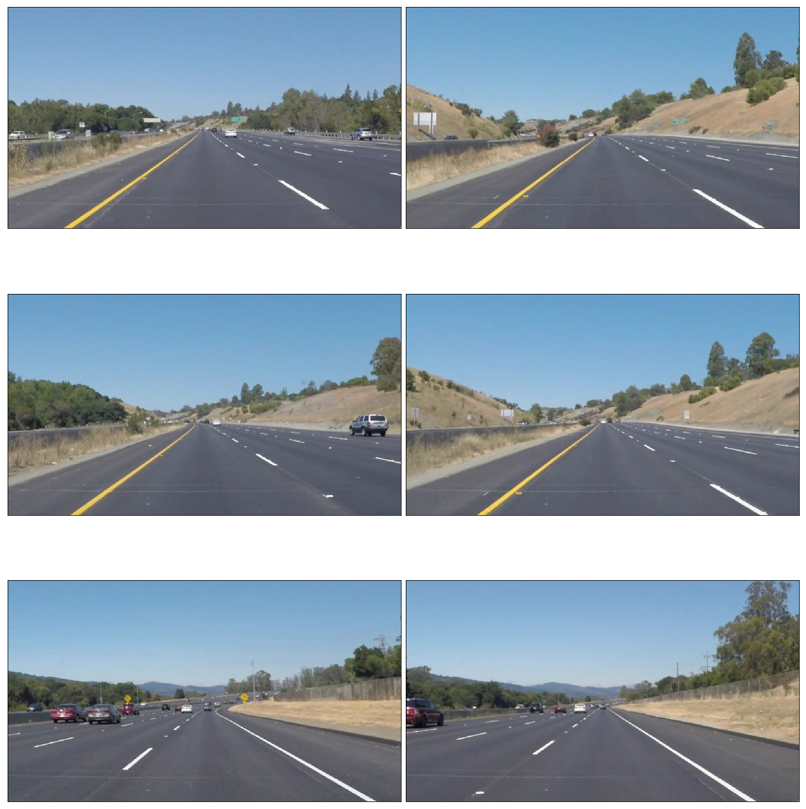
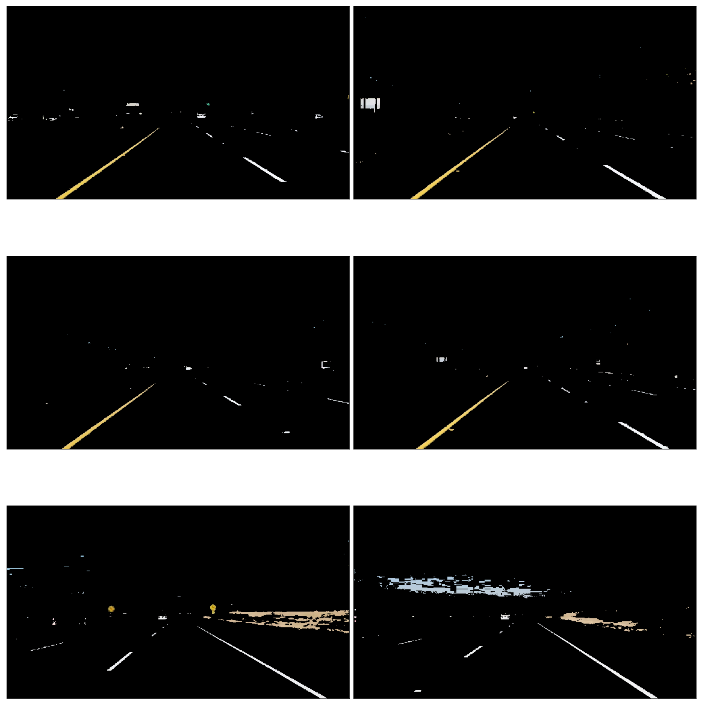
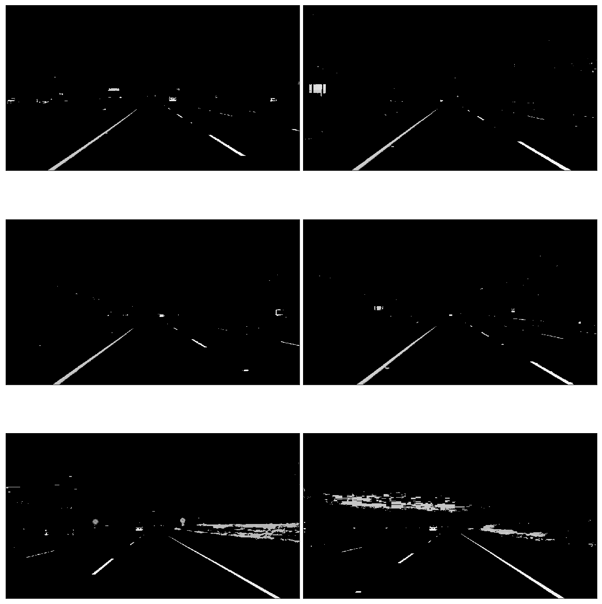
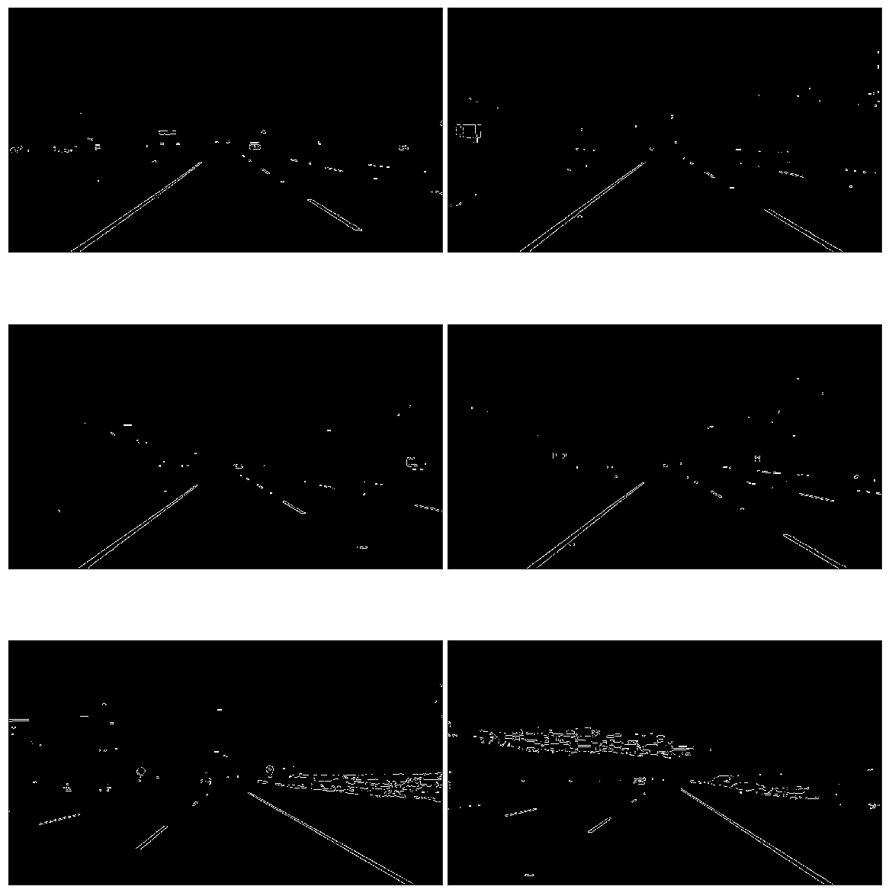
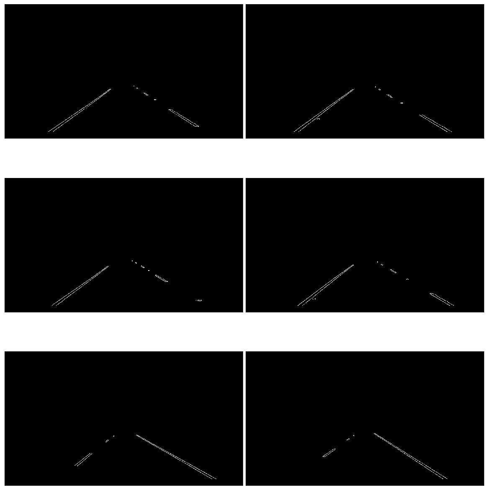
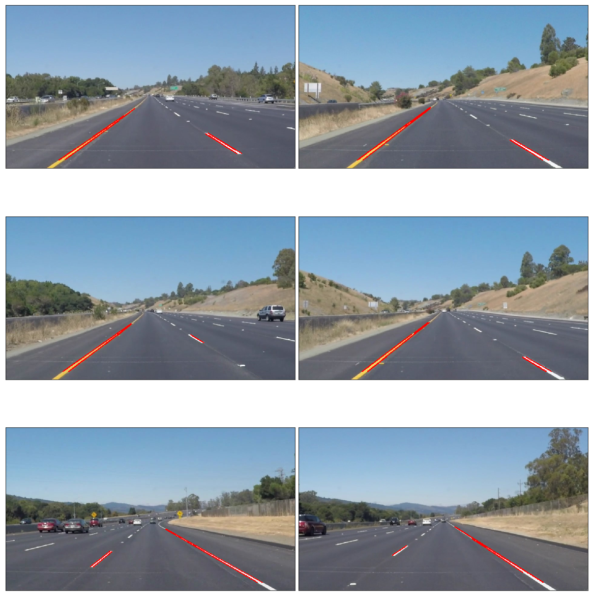
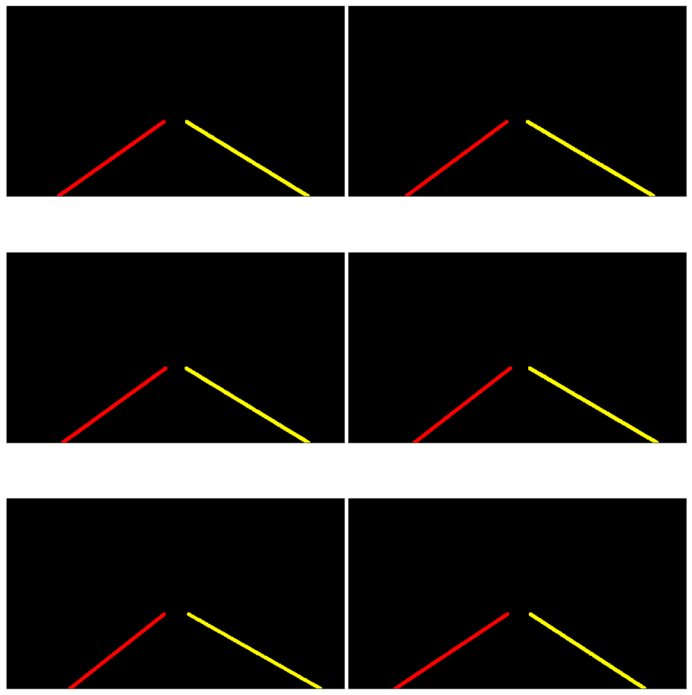
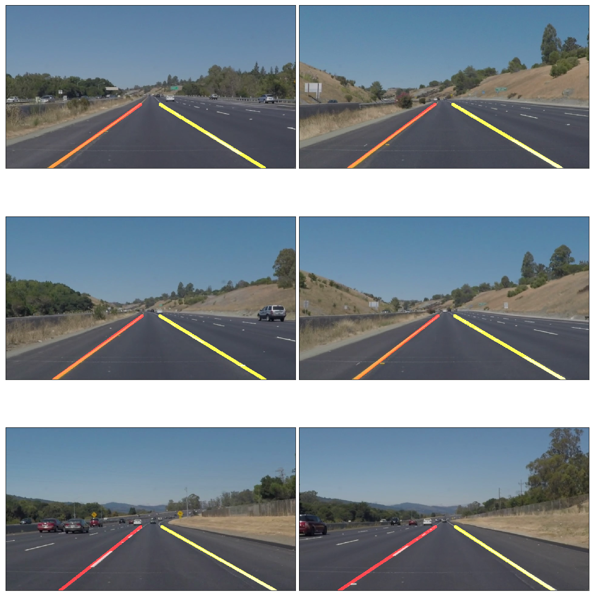

# **Finding Lane Lines on the Road** 

This project is about to find the lane lines on the road. Here I explain my code and the steps to mark the lane lines in some photos and at the end in three videos. It is my first step to learn selfdriving car. Feel free to comment on me and send your suggestions. To **run** this choose **P1_Finding_Lane_Lines.ipynb** project under **jupyter notebook** go to **cell** and choose **run All**. 
##### Thank you
---
### Legend:
* [Importing some useful packages](#useful-packages)
* [Make images table](#make-a-table-for-the-images-to-show-them)
* [Load and read the images](#load-and-read)
* [Filter white and yellow lines](#filter-white-and-yellow)
* [Make gray images](#gray-images)
* [Smoothiong the images](#smoothiong)
* [Canny edges](#Canny-edges)
* [Polygon erea](#polygon-erea)
* [Hough Lines](#Hough-Lines)
* [Draw the Lines](#Draw-the-Lines)
* [Average](#make-an-average)
* [Extrapolation](#extrapolation)
* [Drawing the extrapolated lines](#Drawing-the-extrapolated-lines)
* [Pipeline to call all methods](#Pipeline-to-call-all-methods)
* [Import some more libraries](#Import-everything-needed-to-edit/save/watch-video-clips)
* [Challenge video](#challenge-video)
* [Yellow lane line video](#yellow-lane-line-video)
* [White lane line video](#white-lane-line-video)
* [Shortcomings](#Shortcomings)
* [Possible improvements](#Possible-improvements)


---
#### Useful packages
we need to import following libraries:
```
import matplotlib.pyplot as plt
import matplotlib.image as mpimg
import numpy as np
import cv2
import math
import os, glob
```
* [Back to Legend](#Legend:)
---
#### Make a table for the images to show them
```
def show_images(images, cmap=None):
    cols = 2
    rows = (len(images)+1)//cols
    
    plt.figure(figsize=(16, 18))
    for i, image in enumerate(images):
        plt.subplot(rows, cols, i+1)
        # use gray scale color map if there is only one channel
        cmap = 'gray' if len(image.shape)==2 else cmap
        plt.imshow(image, cmap=cmap)
        plt.xticks([])
        plt.yticks([])
    plt.tight_layout(pad=0, h_pad=0, w_pad=0)
    plt.show()

def show_image(image):
    plt.imshow(image)
       
```


* [Back to Legend](#Legend:)
---
#### Load and read
the images from the folder and run them under the table frame test_images which is a list of images
```
test_images = [plt.imread(path) for path in glob.glob('test_images/*.jpg')]

show_images(test_images)
```
* [Back to Legend](#Legend:)
---
#### Filter white and yellow
Using HLS color space helps to detect yellow and white lane line much better than RGB color space.
color out over HLS color space to cover both yellow and white lane lines I use HLS color space and overlap the result using `cv2.bitwise_or`. 
```
def filter_yellow_white(image):
    HLS_image = cv2.cvtColor(image, cv2.COLOR_RGB2HLS)
    # filter white
    lower = np.uint8([  0, 200,   0])
    upper = np.uint8([255, 255, 255])
    white_mask = cv2.inRange(HLS_image, lower, upper)
    # filter yellow
    lower = np.uint8([10, 0, 90])
    upper = np.uint8([100,255,255])
    yellow_mask = cv2.inRange(HLS_image, lower, upper)
    
    mixed_color_mask = cv2.bitwise_or(white_mask, yellow_mask)
    return cv2.bitwise_and(image, image, mask = mixed_color_mask)
filtered = list(map(filter_yellow_white, test_images))
show_images(filtered)
```

* [Back to Legend](#Legend:)
---
#### Gray images
take the rgb/hls images and make them gray image. I use `cv2.COLOR_RGB2GRAY` method. By converting the white and yellow line into gray scale the edge detection become possible. This step is important to identify gradient changes in the pixels.
```
def make_them_gray(image): 
    #grayscale the image
    return cv2.cvtColor(image, cv2.COLOR_RGB2GRAY)
gray = list(map(make_them_gray, filtered))
show_images(gray)
```

* [Back to Legend](#Legend:)
---
#### Smoothiong
The smoothing level the number must be bigger than 0 and odd 1,3,5,7,...
This method smooths the sharp edges and make it easier for finding the edges by the next method.
```
def smoothing(image):
    kernel_size = 5
    return cv2.GaussianBlur(image, (kernel_size, kernel_size), 0)
blurred = list(map(lambda image:smoothing(image), gray))
show_images(blurred)
```

* [Back to Legend](#Legend:)
---
#### Canny edges
with this method by using `cv2.Canny` method and by applying `low_threshold = 50` and `high_threshold = 150` all lines with gradient between these limits are detected as edges.
```
def make_Canny_edges(image):
    # Define our parameters for Canny and apply
    low_threshold = 50
    high_threshold = 150
    return cv2.Canny(image, low_threshold, high_threshold)
edges = list(map(lambda image:make_Canny_edges(image), blurred))
show_images(edges)
```

* [Back to Legend](#Legend:)
---
####  Polygon erea
Now I bound the erea of interest by defining a polygon erea using `select_region()` method. Filling this polygon erea with white color 255 overlap the bounded erea bitwise using `filter_region()` method. The outcome is lane lines which are in the interested zone. Now we isolated our lane lines from rest of the lines in the images.
```
def filter_region(image, vertices):
    mask = np.zeros_like(image)
    if len(mask.shape)==2:
        cv2.fillPoly(mask, vertices, 255)
    else:
        cv2.fillPoly(mask, vertices, (255,)*mask.shape[2]) # in case, the input image has a channel dimension        
    return cv2.bitwise_and(image, mask)
# feeding filter_region with polygon vertices
def select_region(image):
    # first, define the polygon by vertices
    rows, cols = image.shape[:2]
    bottom_left  = [cols*0.16, rows*0.95]
    top_left     = [cols*0.44, rows*0.61]
    bottom_right = [cols*0.95, rows*0.95]
    top_right    = [cols*0.56, rows*0.61] 
    # the vertices are an array of polygons (i.e array of arrays) and the data type must be integer
    vertices = np.array([[bottom_left, top_left, top_right, bottom_right]], dtype=np.int32)
    return filter_region(image, vertices)

# images showing the region of interest only
masked_edges = list(map(select_region, edges))
show_images(masked_edges)
```

* [Back to Legend](#Legend:)
---
---
#### Hough Lines
We now have bunch of pixels but no lines. It appears to be lines to us because our brain follow the pixels for us. With `cv2.HoughLinesP` method and by setting its parameters we make the line where the pixles build the lines. 

```
def hough_lines(image):11
    # Feeding HoughLinesP: into lines
    # Define the Hough transform parameters
    rho = 2 # distance resolution in pixels of the Hough grid
    theta = np.pi/180     # angular resolution in radians of the Hough grid
    threshold = 20        # minimum number of votes (intersections in Hough grid cell)
    min_line_length = 40  # minimum number of pixels making up a line
    max_line_gap = 7      # maximum gap in pixels between connectable line segments
    # Run Hough on edge detected image
    # Output "lines" is an array containing endpoints of detected line segments
    return cv2.HoughLinesP(image, rho, theta, threshold, np.array([]),
                            min_line_length, max_line_gap)
```
* [Back to Legend](#Legend:)
---
```
def blank_image(image):
    return np.copy(image)*0
```
---
#### Draw the Lines
Where the lines are detected, I mark them with here with red color as you can see.  

```
def draw_lines(image, lines, color=[255, 0, 0], thickness=2, make_copy=True):
    # the lines returned by cv2.HoughLinesP has the shape (-1, 1, 4)
    if make_copy:
        image = np.copy(image) # don't want to modify the original
    for line in lines:
        for x1,y1,x2,y2 in line:
            cv2.line(image, (x1, y1), (x2, y2), color, thickness)
    return image

line_images = []
blank_images = list(map(blank_image, test_images))

list_of_lines = list(map(hough_lines, masked_edges))

for image, lines in zip(test_images, list_of_lines):
    line_images.append(draw_lines(image, lines))
    
show_images(line_images)
```

* [Back to Legend](#Legend:)
---
#### Make an average
By using `np.polyfit`, I gain `z` which has both slope and intercept of a line connecting two pixels. I omit unwanted lines with too high or too low slopes from the original lane lines. The lane lines based on their slope sign are seprated into left and right lane lines. In order smooth the lines apperance in the video which will come later, I make an average on both slope and intercepts. At the begining I made a simple average. I you want to play with them I put the code lines also there and outcomment them. After some struggle I moved to use a weighted average method to give the lines which are longer more weight. This helps on those frames which have a bad lane line marking and hard to detect. For the frames in which no lane lines are detectable, I used the last valid average to maintain the continuity of marking the lane lines. I use also `np.poly1d` to extrapolate the valid calculated average values. 
```
def average_slope(lines, left_aveg, right_aveg):

    # line_image is the empty dark image
    # draw the line with cv2.line
    # Iterate over the output "lines" and draw lines on a blank black image
    # as y axis goes from up to bottom and there is not a same origin for (x and y = 0) 
    # the slope > 0 apears on the left rather than on the right
  
    for line in lines:
        for x1,y1,x2,y2 in line:
            if x1 == x2:
                continue
            z = np.polyfit([x1,x2], [y1,y2], 1)
            length = np.sqrt(((y2 - y1) ** 2) + ((x2 - x1) ** 2))
            # m: slope -- b: intercept
            m, b = z
            
            if abs(m) < 0.4 or abs(m) > 0.8:
                continue
            if m > 0:
                if abs(m - right_aveg[0]) > 0.5 and right_aveg[0] != 0:
                    m = right_aveg[0]
                m_r.append(m)
                b_r.append(b)
                if len(m_r) >1:
                    ave_m_r = np.mean(m_r)
                    ave_b_r = np.mean(b_r)
                else:
                    ave_m_r = m_r[0]
                    ave_b_r = b_r[0]

                z_r = np.array([ave_m_r, ave_b_r])
                if z_r is not None: 
                    right_aveg = z_r
                right_lines.append(z_r) # adding them for later building the average of 
                right_weights.append((length))
                if len(right_weights) <= 0:
                        continue                
            else:
                if abs(m - left_aveg[0]) > 0.5  and left_aveg[0] != 0:
                    m = left_aveg[0]
                m_l.append(m)
                b_l.append(b)
                if len(m_l) >1:
                    ave_m_l = np.mean(m_l)
                    ave_b_l = np.mean(b_l)
                else:
                    ave_m_l = m_l[0]
                    ave_b_l = b_l[0]                
                z_l = np.array([ave_m_l, ave_b_l])
                if z_l is not None:
                    left_aveg = z_l
                left_lines.append(z_l)
                left_weights.append((length))
                if len(left_weights) <= 0:
                        continue
        # make average of all slopes for each line and passes b unchanged to variable
    
    if len(left_lines) == 0:
        left_lines.append(left_aveg)
        left_weights.append(60)
    if len(right_lines) == 0:
        right_lines.append(right_aveg)
        right_weights.append(30)
    
    left_lane  = np.dot(left_weights,  left_lines) / np.sum(left_weights)  if len(left_weights) > 0 else None
    right_lane = np.dot(right_weights, right_lines) / np.sum(right_weights) if len(right_weights) > 0 else None
    
    if right_lane is None:
        f_right = right_lane
    else:
        f_right = np.poly1d(right_lane)    
    if left_lane is None:
        f_left = left_lane
    else:
        f_left = np.poly1d(left_lane)
    return (f_right, f_left, left_aveg, right_aveg)
```    
---
```  
#averages = list(map(average_slope, list_of_lines))
left_aveg = [0,0]
right_aveg = [0,0]
averages = [average_slope(x, left_aveg, right_aveg) for x in list_of_lines]
```
* [Back to Legend](#Legend:)

---

#### Extrapolation
To draw the extrapolated lines I use this function to make 4 points out of known line function y=mx+b 
m is known, b is known, y1 and y2 is given to begin with. I use also diferent color to mark left and right lane lines.
``` 
def create_lines_average(f, thikness, image):
    blank_img = blank_image(image)
    y1 = image.shape[0] # bottom of the image
    y2 = y1*0.61        # under the horizont line -> slightly lower than the middle
    color_edge = create_lines_average_methode(y1, y2, f[0], (255,255,0), thikness, blank_img)
    color_edge = create_lines_average_methode(y1, y2, f[1], (255,0,0), thikness, blank_img)
    return color_edge

def create_lines_average_methode(y1, y2, f, color, thikness, blank_img):
    x1 = int((f - y1).roots) # calculation the x using ploy1d function
    x2 = int((f - y2).roots) # calculation the x using ploy1d function
    y1 = int(y1)
    y2 = int(y2)
    #if left_lane is not None or right_lane is not None:
    color_edges = cv2.line(blank_img,(x1,y1),(x2,y2),color,thikness)
    return color_edges

color_edges = [create_lines_average(ave, 10, image) for (image ,ave) in zip(test_images, averages)]

show_images(color_edges)
```

* [Back to Legend](#Legend:)
---
#### Drawing the extrapolated lines
Now I add the extrapolated lines into real world frames using `cv2.addWeighted` method.
``` 
def draw_lane_lines(image, lines):
    # Create a "color" binary image to combine with line image
    #color_edges = np.dstack((edges, edges, edges)) 

    # Draw the lines on the edge image
    lines_edges = cv2.addWeighted(image, 0.8, lines, 1, 0)
    return lines_edges
lane_images = [draw_lane_lines(image, lines) for (image, lines) in zip(test_images, color_edges)]
                      
show_images(lane_images)
```

* [Back to Legend](#Legend:)
---
## Pipeline to call all methods
As I mentioned before for those frames with no valid marks on the lane lines. I pass the last valid values to mark this frame with something from past frames. To do so I use `global left_aveg` and `global right_aveg` in the pipeline.
Most of the methods above are called here to and each one is feeded with the result of the previous method.

``` 
global left_aveg
global right_aveg

left_aveg  = np.array([0,0])
right_aveg = np.array([0,0])
def process_image(image):
    # NOTE: The output you return should be a color image (3 channel) for processing video below
    # TODO: put your pipeline here,
    # you should return the final output (image where lines are drawn on lanes)

    global right_aveg
    global left_aveg
    gray = make_them_gray(image)
    blurred = smoothing(gray)
    edges = make_Canny_edges(blurred)
    masked_edges = select_region(edges)
    list_of_lines = hough_lines(masked_edges)
    averages = average_slope(list_of_lines, right_aveg, left_aveg)
    if(len(averages)>2):
        right_aveg = averages[2]
        left_aveg  = averages[3]
    color_edges = create_lines_average(averages, 7, image)
    lane_images = draw_lane_lines(image, color_edges)
    return lane_images

#process_image(test_images[0])
``` 
* [Back to Legend](#Legend:)
---
#### Import everything needed to edit/save/watch video clips

``` 
from moviepy.editor import VideoFileClip
from IPython.display import HTML
``` 
---
---
#### challenge video
* [Back to Legend](#Legend:)
* https://youtu.be/8BM_sDQITUc
---
---

#### yellow lane line video
* [Back to Legend](#Legend:)
* https://youtu.be/IcP5wi0-mzk
---
---
#### white lane line video
* [Back to Legend](#Legend:)
* https://youtu.be/FwXP94VMJM4
---
---

### Shortcomings

After all test and tryings I find out that it is really hard to make the lane lines to stop wobbling.
I understand also this algorithm as it is, is not sufficient to address the curvy raods or with poor lane line marking. The raod surface and the shadows and light intensity changing or even braking marks may also make some trouble as well. 

* [Back to Legend](#Legend:)
----
### Possible improvements

There must be a better way to mark the lane lines wobble free. There is also a good way of detecting the lane lines under all light and color conditions. With more advanced algorithm driving on curvy raods must be very possible.

* [Back to Legend](#Legend:)